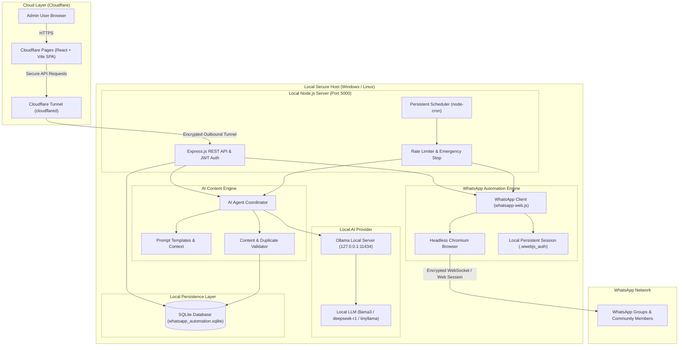
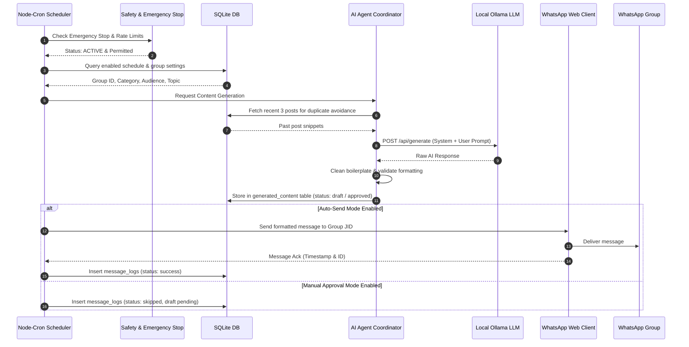

# System Architecture Documentation

This document explains the technical architecture, component relationships, data flow, and Cloudflare integration of the **AI WhatsApp Content Automation System**.

---

## 1. High-Level Architecture Diagram



---

## 2. Component Breakdown

### A. Frontend Layer (Cloudflare Pages)
- **Technology**: React 18, Vite, React Router 6, Vanilla CSS design system, Lucide icons.
- **Hosting**: Build artifacts (`frontend/dist`) are deployed to **Cloudflare Pages**.
- **Security**: Zero backend secrets are embedded in the frontend bundle. All communication is routed through the API client using JWT Bearer tokens.

### B. Secure Remote Access (Cloudflare Tunnel)
- **Concept**: Cloudflare Tunnel (`cloudflared`) establishes a lightweight outbound-only encrypted tunnel from the local Node.js server to Cloudflare edge servers.
- **Advantage**: No public IP exposure, no router port forwarding (no opening port 5000 to the open web), and DDoS protection.
- **Workflow**:
  ```bash
  # Local host initiates outbound tunnel to Cloudflare
  cloudflared tunnel --url http://localhost:5000
  ```
  The generated URL (e.g. `https://my-app-tunnel.trycloudflare.com`) is configured as `VITE_API_URL` in Cloudflare Pages.

### C. Local Backend Server & API
- **Technology**: Node.js, Express.js.
- **Responsibilities**:
  1. REST API endpoint handler.
  2. JWT Authentication & Password verification.
  3. Safety checks (Emergency Stop, max messages/hour, min delay).
  4. Local SQLite database operations.

### D. AI Agent & Ollama Integration
- **Technology**: Local Ollama instance (`http://127.0.0.1:11434`).
- **Prompt Engineering**: Dynamic prompt synthesis based on Category, Topic, Audience persona, Content type, Tone, and Past post history.
- **Quality & Safety Validation**:
  - DeepSeek `<think>` and reasoning tag stripper.
  - Conversational AI boilerplate remover.
  - Jaccard n-gram duplicate detection against past posts stored in SQLite.
  - WhatsApp markdown normalization.

### E. WhatsApp Automation Engine
- **Technology**: `whatsapp-web.js` + Puppeteer.
- **Session Persistence**: Multi-device persistent authentication stored in `.wwebjs_auth/`.
- **Group Synchronization**: Auto-detects all groups from active session without hardcoding.
- **Rate-Limiting & Queue**: Guaranteed interval pauses between messages to prevent spam or flagging.

### F. Persistent Scheduler
- **Technology**: `node-cron`.
- **Background Execution**: Runs directly inside the local Node.js process. Automation tasks continue firing at their scheduled times regardless of whether the browser or dashboard is open.

---

## 3. Automated Daily Flow Diagram


