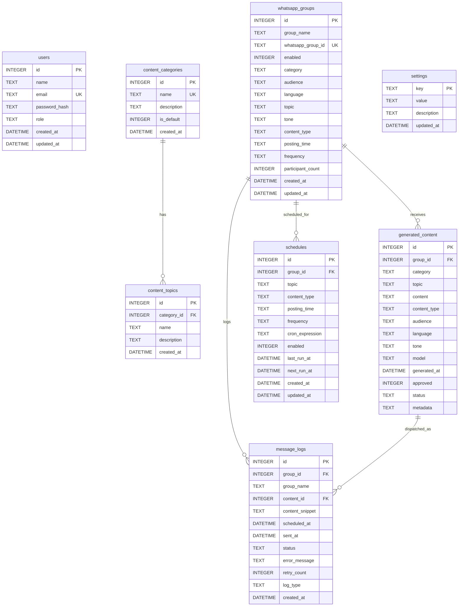

# SQLite Database Documentation

The AI WhatsApp Content Automation System uses **SQLite** with Write-Ahead Logging (`WAL`) mode enabled for high concurrency, durability, and fast local execution.

Database file location: `./database/whatsapp_automation.sqlite`

---

## 1. Entity Relationship Diagram (ERD)



---

## 2. Table Specifications

### `users`
Stores administrative accounts.
- `id`: Primary key (autoincrement).
- `name`: Admin display name.
- `email`: Unique login email.
- `password_hash`: Bcrypt hashed password (10 salt rounds).
- `role`: Role string (`admin`).

### `content_categories`
Content domains (Data Analytics, Python, SQL, Generative AI, SEO, etc.).

### `content_topics`
Curated topics tied to each category.

### `whatsapp_groups`
Detected WhatsApp groups synchronized from active session.
- `whatsapp_group_id`: Unique WhatsApp JID (e.g. `120363024829102934@g.us`).
- `enabled`: `1` if automation is active, `0` if paused.
- `category`, `audience`, `language`, `topic`, `tone`, `content_type`: Group-specific generation settings.
- `posting_time`, `frequency`: Schedule parameters.

### `generated_content`
Historical repository of all LLM generated posts.
- `status`: `draft`, `approved`, `rejected`, `sent`, `failed`.
- `metadata`: JSON payload containing duplicate similarity scores and evaluation metrics.

### `schedules`
Recurring automation configurations registered with `node-cron`.

### `message_logs`
Delivery audit log tracking dispatches, retries, and errors.
- `status`: `success`, `failed`, `retrying`, `skipped`.
- `log_type`: `scheduled`, `manual_test`, `immediate`.

### `settings`
Key-value configuration store for safety thresholds and global flags (`emergency_stop`, `auto_send_enabled`, `max_messages_per_hour`, `min_delay_between_messages_sec`, `max_retries`).

---

## 3. Database Maintenance & Backup

### Backup Database:
```bash
# Windows PowerShell
Copy-Item ./database/whatsapp_automation.sqlite ./database/backup_whatsapp_automation.sqlite
```

### Reset & Reseed Database:
```bash
npm run seed
```
